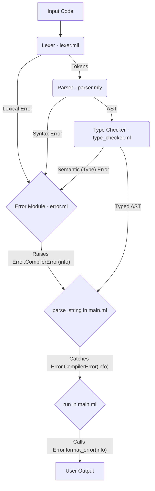

# Final Plan: Comprehensive & Unified Error Handling (Lexer, Parser, Type Checker)

This document outlines the plan to implement robust and unified error handling across the lexer, parser, and type checker stages of the CompeteX compiler. The goal is to provide clear, informative, and consistently formatted error messages to the user, pinpointing the location of the error in the source code.

## 1. Establish Unified Error Module (`lib/common/error.ml`, `error.mli`)

*   **Goal:** Centralize error definition and formatting for all compiler stages (lexical, syntax, semantic/type).
*   **Action:**
    *   Create `lib/common/error.mli` (interface) and `lib/common/error.ml` (implementation).
    *   Define `Ast.location` (already exists in `lib/common/ast.ml`).
    *   Define an `error_info` record type: `{ message: string; loc: Ast.location; context: string option (* Optional context, e.g., expected token *) }`.
    *   Define a custom exception: `exception CompilerError of error_info`.
    *   Implement helper functions:
        *   `make_error : message:string -> loc:Ast.location -> ?context:string -> unit -> error_info` - Creates an error info record.
        *   `raise_error : message:string -> loc:Ast.location -> ?context:string -> unit -> 'a` - Creates error info and raises `CompilerError`.
        *   `format_error : error_info -> string` - Creates a user-friendly string representation (e.g., "Error at line L, column C: [message]").
        *   `loc_of_lexbuf : Lexing.lexbuf -> Ast.location` - Extracts start and end position from the lexer buffer to create an `Ast.location`.

## 2. Enhance Lexer (`lib/frontend/lexer.mll`)

*   **Goal:** Catch lexical errors (unexpected characters, invalid strings) and use the new error module.
*   **Action:**
    *   Add `open Common.Error` to the header (`{ ... }`).
    *   Replace existing `raise (Failure ...)` calls for string errors with calls to `Error.raise_error`, providing appropriate messages and using `Error.loc_of_lexbuf lexbuf` for the location.
    *   Add a final catch-all rule to the main `read` rule: `| _ as c -> Error.raise_error ~message:("Unexpected character: " ^ Char.escaped c) ~loc:(Error.loc_of_lexbuf lexbuf) ()`.

## 3. Improve Parser (`lib/frontend/parser.mly`)

*   **Goal:** Use Menhir's advanced error handling (`%error` token) to provide specific syntax error messages instead of the generic "Syntax error".
*   **Action:**
    *   Add `open Common.Error` to the header (`%{ ... %}`).
    *   Add `%token ERROR` to the token declaration section.
    *   Add error-specific productions within the grammar rules (`%% ... %%`) where syntax errors are likely or where specific messages are helpful, raising `Error.CompilerError` via `Error.raise_error`. Examples:
        *   `stmt: error { Error.raise_error ~message:"Syntax error: Invalid statement" ~loc:(Error.loc_of_lexbuf $lexbuf) () }`
        *   `stmt: x = ID; ASSIGN; error { Error.raise_error ~message:"Syntax error: Expected expression after assignment operator ':='" ~loc:(Error.loc_of_lexbuf $lexbuf) () }`
        *   *(Identify other key places for specific error rules).*

## 4. Integrate Type Checker (`lib/common/type_checker.ml`)

*   **Goal:** Modify the type checker to raise `Error.CompilerError` for type mismatches and other semantic errors using the unified module.
*   **Action:**
    *   Add `open Common.Error` at the top of the file.
    *   **Remove** the existing `type_error` helper function (previously lines 25-27).
    *   **Replace** all calls `type_error message loc` throughout the file with `Error.raise_error ~message ~loc ()`. Ensure the `message` string and the correct `Ast.location` (`loc`) variable are passed.

## 5. Integrate with Driver Code (`bin/main.ml`)

*   **Goal:** Catch the single `Error.CompilerError` exception, covering lexical, syntax, and type errors, from both parsing and type checking, and report using the unified format.
*   **Action:**
    *   Modify the `try...with` block in `parse_string` (currently lines 7-12) to wrap *both* the `Frontend.Parser.main` call *and* the `Common.Type_checker.type_check_program` call.
    *   Use a single handler: `| Error.CompilerError info -> Core.Or_error.error_string (Error.format_error info)`. This handler will now catch errors raised from the lexer, parser, *and* type checker.

## Final Mermaid Diagram of Error Flow

## Future Enhancements

*   Refine parser error productions for even more specific and helpful messages.
*   Consider adding context (e.g., the problematic line of code) to the formatted error messages within `Error.format_error`.